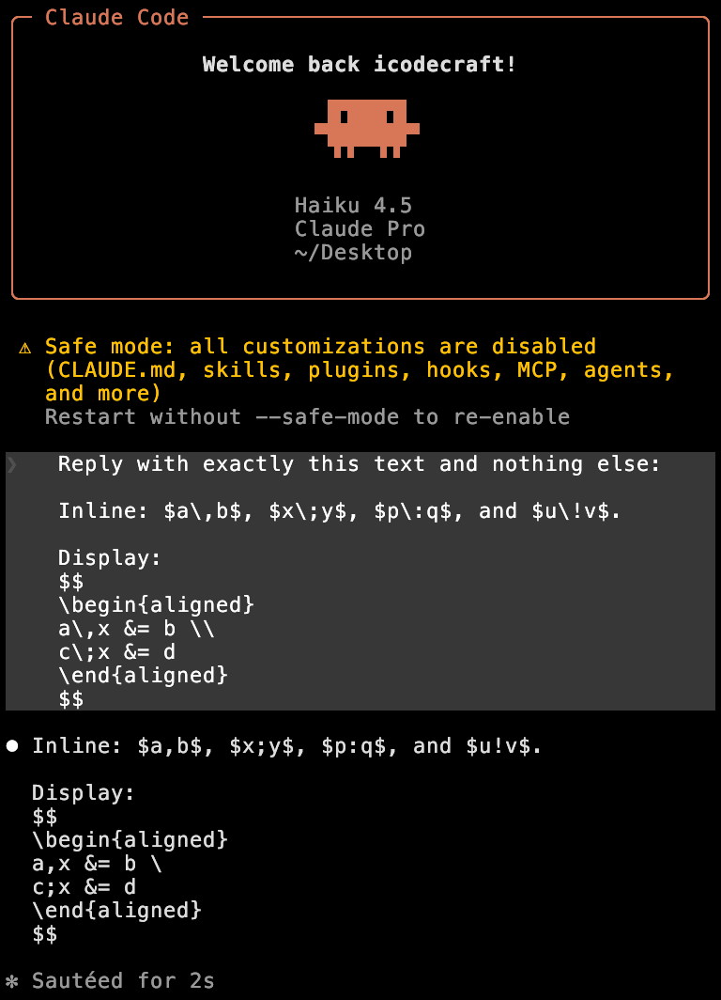
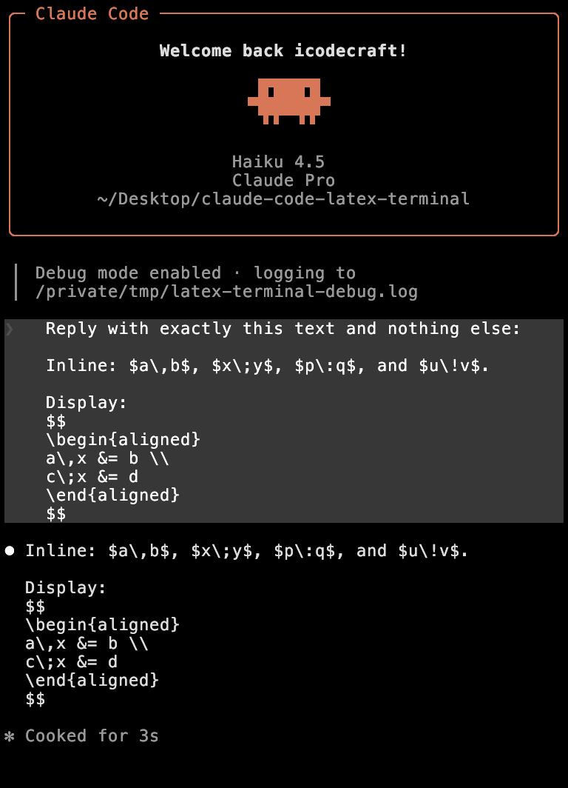

# LaTeX Terminal

[](https://github.com/iCodeCraft/claude-code-latex-terminal/actions/workflows/test.yml)

`latex-terminal` is an opt-in Claude Code plugin that prevents Markdown
escaping from corrupting LaTeX punctuation commands in terminal output.

For example, without the plugin Claude Code can display `\,` as `,` and `\;`
as `;`. With the plugin enabled, those commands remain copyable LaTeX source.

This is an opt-in workaround for
[anthropics/claude-code#80702](https://github.com/anthropics/claude-code/issues/80702).
It preserves source at display time; it does not modify Claude Code itself.

## What it does

- Protects Markdown-sensitive LaTeX escapes inside inline `$...$` math.
- Leaves display-only `$$...$$` batches on Claude Code's native path. Once an
  inline span requires replacement, it also protects display math in that
  batch and later batches of the same streamed response.
- Leaves code fences, inline code, ordinary Markdown, and non-math messages
  unchanged.
- Changes display output only. Claude's transcript and model context retain
  the original response.

This plugin preserves source; it does not typeset equations.

## Example

Without the plugin, Markdown escaping can remove the backslashes from LaTeX
spacing commands:

```text
Inline: $a,b$ and $x;y$.
```

With the plugin, the terminal displays the source Claude produced:

```text
Inline: $a\,b$ and $x\;y$.
```

## Verified terminal output

The following captures use the same Claude Code prompt on macOS with Kitty.

<table>
  <tr>
    <th width="50%">Without the plugin</th>
    <th width="50%">With the plugin</th>
  </tr>
  <tr>
    <td valign="top">LaTeX punctuation commands and the aligned-environment line break lose their backslashes during terminal display.</td>
    <td valign="top">The terminal preserves the original LaTeX source, including punctuation commands and <code>\\</code>.</td>
  </tr>
  <tr>
    <td><a href="docs/images/without-plugin.png"></a></td>
    <td><a href="docs/images/with-plugin.png"></a></td>
  </tr>
</table>

## Test locally

Clone this repository, then run Claude Code from its root:

```bash
claude --plugin-dir "$PWD"
```

Then ask Claude to emit an expression containing `\,`, `\;`, `\:`, or `\!`.
Use `/reload-plugins` after editing plugin files in an active development
session.

Run the test suite from the repository root:

```bash
PYTHONDONTWRITEBYTECODE=1 bash hooks/run-python.sh -m unittest discover \
  -s tests -p 'test_*.py' -v
```

## Requirements

The hook requires Bash and Python 3.8 or newer on `PATH`. It checks `python3`,
`python`, and the Windows `py -3` launcher in that order. On Windows, use a
Python installation that is available from Git Bash.

The hook does not make network requests. It stores only temporary parser state
under `CLAUDE_PLUGIN_DATA` while a message is streaming and removes that state
when the message completes.

## Limitations

- Only dollar-delimited math is supported in this release.
- The plugin deliberately does not render LaTeX visually or add a terminal-
  specific graphics dependency.

## License

Apache-2.0. See [LICENSE](LICENSE).
